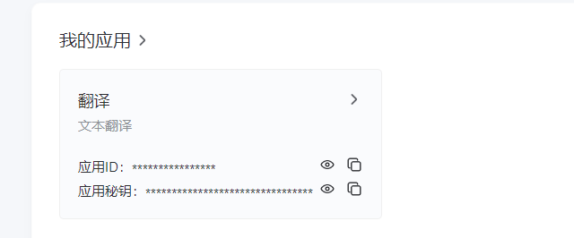
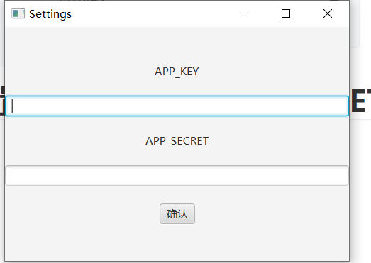
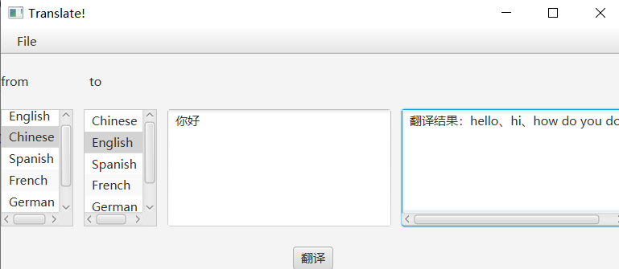

# javafxTranslate
用javafx搞一个简单版翻译app

本地环境：   idea2023、jdk17

# 第一步：在有道调用api上面注册一个账号并创建应用

有道api官网：[有道智云AI开放平台 (youdao.com)](https://ai.youdao.com/?keyfrom=fanyi-new-nav#/)

注册好了，之后创建应用

# 第二步：设置APP_KEY和APP_SECRET

然后点击确认。

# 第三步：点击要翻译的源语言和目的语言

# 第四步：点击翻译

