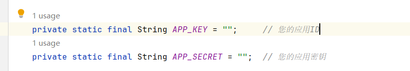
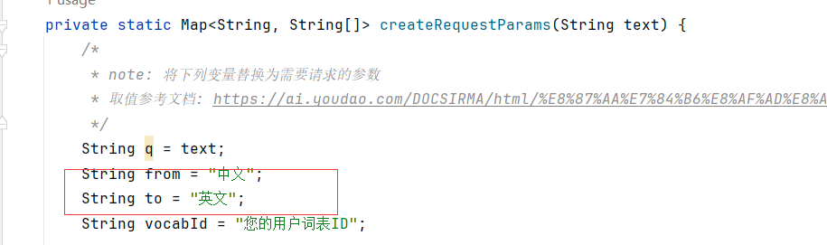
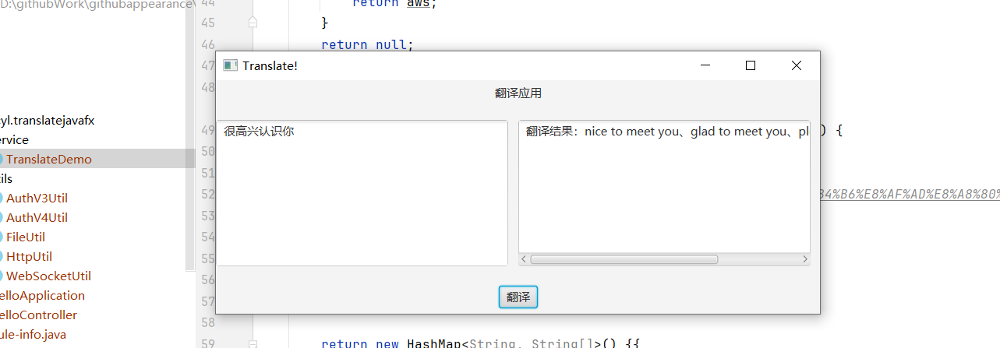

# javafxTranslate
用javafx搞一个简单版翻译app

本地环境：   idea2023

​                      jdk17

# 第一步：在有道调用api上面注册一个账号并创建应用

有道api官网：[有道智云AI开放平台 (youdao.com)](https://ai.youdao.com/?keyfrom=fanyi-new-nav#/)

注册好了，之后创建应用

# 第二步：复制id和密钥到项目文件中

这里默认是中文转换成英文，如果各位想改也可以改动

将这个改一下即可

# 第三步：启动项目

